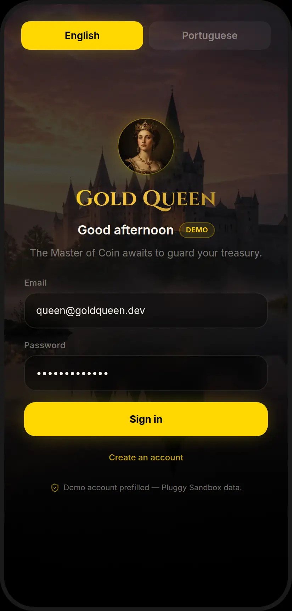
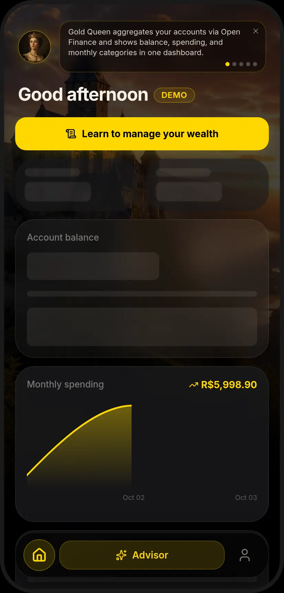
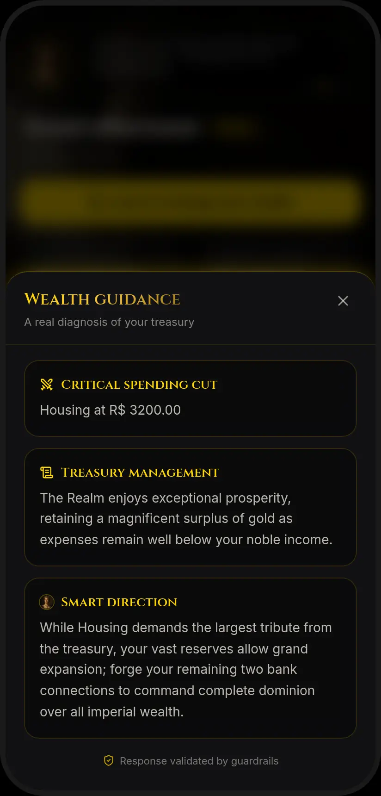

<p align="center">
  
</p>

# Gold Queen Web

React dashboard for a personal treasury: balance, spending, Queen's Tips, and a guardrailed advisor. It is the interface for [gold-queen-api](https://github.com/luizssantiago92/gold-queen-api).

[](https://github.com/luizssantiago92/gold-queen-web/actions/workflows/ci.yml)
[](https://github.com/luizssantiago92/gold-queen-web/actions/workflows/codeql.yml)
[](https://nodejs.org/)
[](LICENSE)

| | |
| --- | --- |
| Live app | https://gold-queen-web.vercel.app |
| API docs | https://gold-queen-api.onrender.com/docs |
| API repo | https://github.com/luizssantiago92/gold-queen-api |

The public demo is read-only. The login form prefills this account, created by the API seed:

| Email | Password |
| --- | --- |
| `queen@goldqueen.dev` | `QueenDemo123!` |

Connect, sync, and unlink return `403` with code `demo_read_only`. Registration is closed. Reads, Queen's Tips, and chat still work.

<p align="center">
  
  
  
</p>

## What a frontend review will find

- **Cold start.** On boot the app calls `GET /health` on the API. A reply in under 1.5s leaves the UI alone. After that, a status screen with a progress bar covers the shell until the probe succeeds or 90s pass. The app behind the screen is `inert`. The spinner and bar use `motion-safe:`, so `prefers-reduced-motion` keeps them still. The failure state offers a retry.
- **Accessibility.** Modals use `role="dialog"` and `aria-modal`, close on Escape, and name the close control. The wake screen is a live region with a labeled progress bar. User-facing copy is in English and Portuguese catalogs (`src/i18n/`). English is the default; Portuguese is chosen when the browser language is Portuguese or the visitor toggles it.
- **Tests.** Vitest and Testing Library cover auth, the API client, the wake gate, security headers, and the main screens, including home, chat, Queen's Tips, and the transaction feed. CI runs `npm run test:coverage` and fails if v8 coverage drops under the thresholds in `vite.config.ts`. There is no external coverage service and no coverage badge.
- **Bundle.** Chat, Queen's Tips, transaction detail, and the monthly spending chart load as separate chunks. The first script stays under Vite's 500 kB warning.
- **CI.** GitHub Actions runs oxlint, the TypeScript build (app, Node config, and tests), coverage, and `npm audit --audit-level=high` on Node 22. Third-party actions are pinned to commit SHAs. CodeQL analyzes JavaScript/TypeScript and GitHub Actions. Dependabot opens a weekly pull request of grouped minor and patch updates for npm, and another for GitHub Actions. The CI token is `contents: read`. CodeQL also requests `actions: read` and `security-events: write`.
- **Headers.** [`vercel.json`](vercel.json) sends a Content-Security-Policy with `script-src 'self'` (no inline scripts), `X-Content-Type-Options: nosniff`, `X-Frame-Options: DENY`, a referrer policy, and a permissions policy that disables camera, microphone, geolocation, and payment. The JWT lives in `localStorage`. The script policy is what keeps other scripts off the page.

Secrets such as Pluggy and Gemini keys stay on the API. The only public setting in this bundle is `VITE_API_BASE_URL`.

## Stack

| Layer | Choice |
| --- | --- |
| UI | React 19, TypeScript (strict), Vite 8 |
| Style | Tailwind CSS v4 |
| Data | TanStack Query 5, Axios |
| Charts | Recharts |
| Icons | Lucide React |
| Host | Vercel. The API runs on Render |
| Quality | oxlint, `tsc`, Vitest, `npm audit`, CodeQL |

There is no React Router. Home and Profile are local state inside `App.tsx`.

## Run locally

Tested with Node 22. The major is pinned in [`.nvmrc`](.nvmrc) and `package.json` `engines`, and CI installs that same major.

```bash
git clone https://github.com/luizssantiago92/gold-queen-web.git
cd gold-queen-web
npm ci
cp .env.example .env
npm run dev
```

Open http://localhost:5173

Use the host name `localhost`. The production API allows `http://localhost:5173` and rejects `http://127.0.0.1:5173`. Vite preview on port 4173 is not on the allowlist either.

To skip a local API, set `VITE_API_BASE_URL=https://gold-queen-api.onrender.com` in `.env` and restart `npm run dev`. A local API is [gold-queen-api](https://github.com/luizssantiago92/gold-queen-api) on port 8000.

```bash
npm test
npm run test:coverage
npm run lint
npm run build
```

## Environment

Names only. See [`.env.example`](.env.example). `VITE_*` values are inlined at build time and are public.

| Variable | Role |
| --- | --- |
| `VITE_API_BASE_URL` | API origin. Default `http://127.0.0.1:8000`. Production on Vercel is `https://gold-queen-api.onrender.com`. |

Do not put `PLUGGY_CLIENT_SECRET` or `GEMINI_API_KEY` in this repo.

## Layout

```
src/screens/     Login, Home, Profile
src/components/  shell, modals, dashboard cards, wake screen
src/lib/         Axios client, TanStack Query hooks, wake probe
src/auth/        JWT session
src/i18n/        English and Portuguese catalogs
docs/guide/      longer guides
docs/screenshots/ README captures
docs/history/    original product brief
.github/         CI, CodeQL, Dependabot
```

Guides: [docs/guide/README.md](docs/guide/README.md). The original brief is [docs/history/prd.md](docs/history/prd.md). This README and `docs/guide/` are the current reference.

## License

[MIT](LICENSE). Copyright 2026 Luiz Santiago.

## Author

Luiz Santiago, Rio de Janeiro. GitHub: [luizssantiago92](https://github.com/luizssantiago92).
