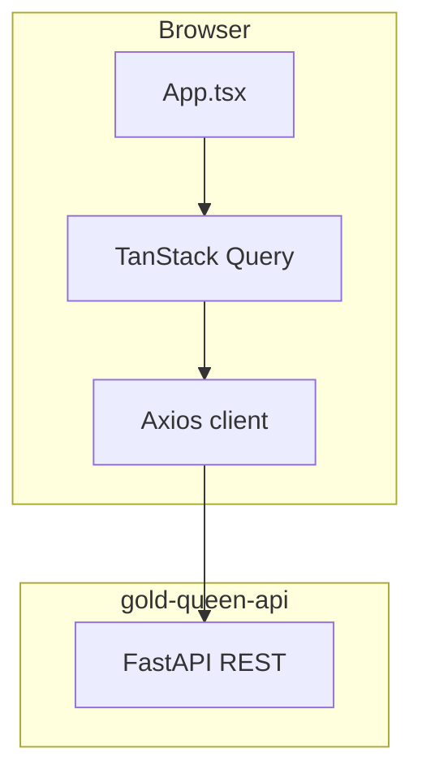

# Architecture

## High-level flow



No React Router — navigation is local state (`home` | `profile`) inside `App.tsx`. Auth gate: `loading` → `anonymous` → `authenticated`.

## Bootstrap (`main.tsx`)

```
I18nProvider (default pt, persisted in localStorage)
  └── QueryClientProvider (staleTime 60s, no retry on 401)
        └── AuthProvider (JWT)
              └── App
```

## Screens

| Screen | Route | Responsibilities |
| --- | --- | --- |
| `LoginScreen` | `status === 'anonymous'` | Demo credentials, cold-start retry messaging |
| `HomeScreen` | `tab === 'home'` | Dashboard cards, demo banner, connect info modal |
| `ProfileScreen` | `tab === 'profile'` | User info, language switch, bank list, roadmap placeholders |

Global modals (controlled by `App.tsx`):

- `QueenTipsModal` — fetches `/v1/advisor/queen-tips` on open
- `ChatModal` — `POST /v1/chat/query`, handles `429` with API persona text

## Layout components

| Component | Role |
| --- | --- |
| `MobileShell` | Phone frame on desktop; full viewport on mobile |
| `SceneBackdrop` | Wallpaper per scene; 5-image slideshow on home (5s interval) |
| `BottomNav` | Home · "Pergunte a Rainha" (opens chat) · Profile |
| `HomeHeader` | Queen portrait, rotating demo info banner, greeting, logout |

## Home dashboard cards

| Component | API endpoint |
| --- | --- |
| `CashFlowRow` | `overview` (month income / expenses) |
| `BalanceCard` | `overview` (total + per-bank bars) |
| `MonthChartCard` | `monthly-series` (Recharts area) |
| `CategoriesCard` | `categories` (display category breakdown) |
| `TransactionFeed` | `transactions` page 1 — tap opens `TransactionDetailModal` |

## API client (`lib/api.ts`)

- Base URL from `VITE_API_BASE_URL`
- JWT in `localStorage` (`gold-queen.token`)
- 90s timeout (Render cold start); 120s for AI routes
- Automatic retry on network errors for GET and login
- `401` clears token and emits `gold-queen:unauthorized`

## Internationalization

- Catalogs: `src/i18n/pt.ts`, `src/i18n/en.ts`
- Default locale: `pt` (not browser-detected)
- `formatMoney`, `formatDay`, `formatReferenceMonth` respect active locale
- Currency remains BRL (Brazilian product)

## Guardrail UX

Transactions with `is_guarded: true` show a gold `ShieldCheck` in the feed. Queen's Tips and chat responses expose `is_guarded` / `from_cache` where relevant.

## Intentional demo limitations

| Feature | Behaviour |
| --- | --- |
| `ConnectBankButton` | Modal explaining demo limits — no Pluggy widget |
| Open Finance hooks | Removed from UI; API still supports connect/sync for future use |
| Card gallery / investments | Static "coming soon" in Profile |

## Build output

Vite produces a static SPA in `dist/`. No SSR. Environment variables are inlined at build time — set `VITE_API_BASE_URL` in Vercel project settings for production.
