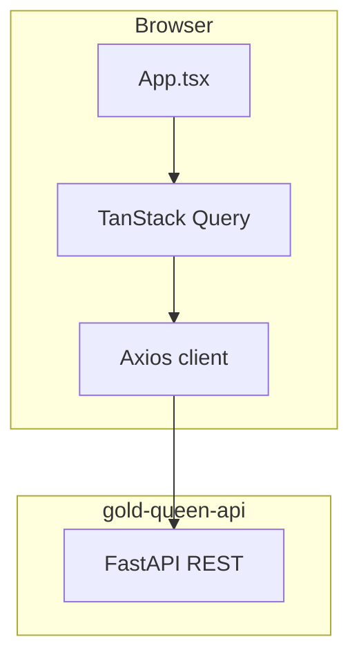

# Architecture

Technical map of Gold Queen Web — screens, state, API integration, and layout.

---

## High-level flow



No React Router. Navigation is local state (`home` | `profile`) inside `App.tsx`. Auth gate: `loading` → `anonymous` → `authenticated`.

---

## Bootstrap (`main.tsx`)

```text
I18nProvider (readLocale → en default, pt if browser/storage says so)
  └── QueryClientProvider (staleTime 60s, no retry on 401)
        └── AuthProvider (JWT)
              └── App
```

---

## Screens

| Screen | When shown | Responsibilities |
| --- | --- | --- |
| `LoginScreen` | `status === 'anonymous'` | Demo credentials, language toggle, cold-start messaging |
| `HomeScreen` | `tab === 'home'` | Dashboard cards, demo banner, connect CTA, tips entry |
| `ProfileScreen` | `tab === 'profile'` | User info, language, banks, logout |

Global modals (controlled by `App.tsx`):

| Modal | Trigger | API |
| --- | --- | --- |
| `QueenTipsModal` | "Learn to manage your wealth" button | `GET /v1/advisor/queen-tips?locale=` |
| `ChatModal` | Bottom nav **Advisor** | `POST /v1/chat/query` `{ question, locale }` |
| `TransactionDetailModal` | Tap row in feed | `GET /v1/dashboard/transactions/:id` |
| Connect bank info | `ConnectBankButton` | None (informational) |

---

## Layout components

| Component | Role |
| --- | --- |
| `MobileShell` | Phone frame on desktop (~412px); full viewport on mobile |
| `SceneBackdrop` | Wallpaper per scene; slideshow on home (5s interval) |
| `BottomNav` | Home · **Advisor** (opens chat) · Profile |
| `HomeHeader` | Queen portrait, `DemoInfoBanner`, greeting + Demo badge |
| `LanguageToggle` | EN/PT segmented control (Login + Profile) |

---

## Home dashboard

| Component | API source | Notes |
| --- | --- | --- |
| `CashFlowRow` | `overview` | Month income / expenses |
| `BalanceCard` | `overview` | Total + per-bank share bars |
| `MonthChartCard` | `monthly-series` | Recharts cumulative area |
| `CategoriesCard` | `categories` | Display category breakdown |
| `TransactionFeed` | `transactions` page 1 | Tap → detail modal |
| `ConnectBankButton` | — | Shown **early** when `banks.length === 0`, else at bottom |

Cards do **not** show chevrons unless they navigate somewhere (none do today).

---

## API client (`lib/api.ts`)

| Concern | Implementation |
| --- | --- |
| Base URL | `import.meta.env.VITE_API_BASE_URL` (fallback `http://127.0.0.1:8000`) |
| Auth header | `Authorization: Bearer <token>` when token exists |
| Locale header | `Accept-Language` on every request via `readLocale()` |
| Timeout | 90s default; 120s for AI routes (`AI_TIMEOUT_MS`) |
| Retry | Network errors on GET and login only (max 2, 4s delay) |
| 401 | Clears token, emits `gold-queen:unauthorized` |

---

## Query hooks (`lib/queries.ts`)

| Hook | Endpoint | Notes |
| --- | --- | --- |
| `useOverview` | `/v1/dashboard/overview` | Refetch 60s |
| `useCategories` | `/v1/dashboard/categories` | |
| `useMonthlySeries` | `/v1/dashboard/monthly-series` | |
| `useTransactions` | `/v1/dashboard/transactions` | Refetch 60s |
| `useTransactionDetail` | `/v1/dashboard/transactions/:id` | Enabled when id set |
| `useConnections` | `/v1/connections` | Profile bank list |
| `useQueenTips` | `/v1/advisor/queen-tips` | `locale` query param; enabled when modal open |
| `useAskQueen` | `/v1/chat/query` | Mutation; body includes `locale` |

Queen's Tips query key includes locale so switching language refetches when the modal reopens.

---

## AI integration

### Queen's Tips

- Fetched only when `QueenTipsModal` opens (`enabled: open`)
- `staleTime: Infinity` — backend caches daily
- Renders three scroll sections + optional guarded/cache footer

### Chat

- Greeting seeded when modal opens
- `429` sets blocked state and shows API persona limit copy
- Remaining quota shown in modal subtitle after first successful reply

---

## Internationalization

See [Internationalization.md](Internationalization.md) for locale detection, catalogs, and formatting rules.

---

## Guardrail UX

| Signal | UI |
| --- | --- |
| `transaction.is_guarded` | Gold `ShieldCheck` in feed (`transactionGuardedBadge` aria-label) |
| `detail.is_guarded` | Copy in transaction detail modal |
| `tips.is_guarded` | Footer in Queen's Tips modal |

---

## Demo limitations (by design)

| Feature | Behaviour |
| --- | --- |
| `ConnectBankButton` | Modal only — no Pluggy widget |
| `DemoInfoBanner` | Auto-rotate, manual dots, dismiss, pause on hover |
| Profile cards / invest | Static placeholders |
| Home header | No logout button |

---

## Build output

Vite produces a static SPA in `dist/`. No SSR. Environment variables are inlined at **build time** — set `VITE_API_BASE_URL` in Vercel for production.

Back to [guide index](README.md)
