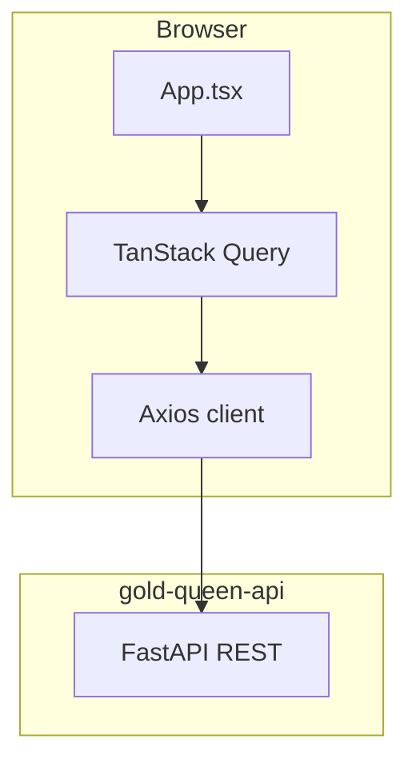

# Architecture

Technical map of Gold Queen Web — screens, state, API integration, and layout.

---

## High-level flow


```mermaid
flowchart TB
  subgraph browser [Browser]
    App[App.tsx]
    Query[TanStack Query]
    API[Axios client]
  end
  subgraph backend [gold-queen-api]
    REST[FastAPI REST]
  end
  App --> Query --> API --> REST
```

No React Router. Navigation is local state (`home` | `profile`) inside `App.tsx`. Auth gate: `loading` → `anonymous` → `authenticated`.

---

## Bootstrap (`main.tsx`)

```text
I18nProvider (readLocale → en default, pt if browser/storage says so)
  └── QueryClientProvider (staleTime 60s, no retry on 401)
        └── ApiWakeGate (GET /health in parallel; does not block the shell)
              └── AuthProvider (JWT)
                    └── App
```

---

## Screens

| Screen | When shown | Responsibilities |
| --- | --- | --- |
| `LoginScreen` | `status === 'anonymous'` | Demo credentials, language toggle, cold-start messaging |
| `HomeScreen` | `tab === 'home'` | Dashboard cards, demo banner, connect CTA, tips entry |
| `ProfileScreen` | `tab === 'profile'` | User info, language, banks, logout |

Global modals (controlled by `App.tsx`):

| Modal | Trigger | API |
| --- | --- | --- |
| `QueenTipsModal` | "Learn to manage your wealth" button | `GET /v1/advisor/queen-tips?locale=` |
| `ChatModal` | Bottom nav **Advisor** | `POST /v1/chat/query` `{ question, locale }` |
| `TransactionDetailModal` | Tap row in feed | `GET /v1/dashboard/transactions/:id` |
| Connect bank info | `ConnectBankButton` | `POST /v1/connections/connect`, then an explanation modal. The public demo rejects the call as read-only and does not open Pluggy. |

---

## Layout components

| Component | Role |
| --- | --- |
| `MobileShell` | Phone frame on desktop (~412px); full viewport on mobile |
| `SceneBackdrop` | Wallpaper per scene; slideshow on home (5s interval) |
| `BottomNav` | Home · **Advisor** (opens chat) · Profile |
| `HomeHeader` | Queen portrait, speech bubble aimed at it, greeting + Demo badge |
| `LanguageToggle` | EN/PT segmented control (Login + Profile) |

---

## Home dashboard

| Component | API source | Notes |
| --- | --- | --- |
| `CashFlowRow` | `overview` | Month income / expenses |
| `BalanceCard` | `overview` | Total + per-bank share bars |
| `MonthChartCard` | `monthly-series` | Recharts cumulative area |
| `CategoriesCard` | `categories` | Display category breakdown |
| `TransactionFeed` | `transactions` page 1 | Tap → detail modal |
| `ConnectBankButton` | — | Shown **early** when `banks.length === 0`, else at bottom |

Cards do **not** show chevrons unless they navigate somewhere (none do today).

---

## API client (`lib/api.ts`)

| Concern | Implementation |
| --- | --- |
| Base URL | `import.meta.env.VITE_API_BASE_URL` (fallback `http://127.0.0.1:8000`) |
| Auth header | `Authorization: Bearer <token>` when token exists |
| Locale header | `Accept-Language` on every request via `readLocale()` |
| Timeout | 90s default; 120s for AI routes (`AI_TIMEOUT_MS`) |
| Retry | Network errors on GET and login only (max 2, 4s delay) |
| 401 | Clears token, emits `gold-queen:unauthorized` |

### Cold-start wake (`ApiWakeGate`)

On boot — the moment the sign-in page opens for a visitor without a session — `wakeApi` calls `GET /health` on the same `API_BASE_URL` (not the shared Axios client, so the JWT retry interceptor does not spend the wake budget). The form stays editable the whole time. A reply in under 1.5s leaves the form alone. After that, a notice with a progress bar sits above the fields until the probe succeeds or 90s pass. The notice does not use `inert` and does not cover the screen. Each attempt waits up to 60s; fast failures back off from 1s to 8s. The failure state offers a retry next to the still-usable form. Motion on the spinner and bar is limited to `motion-safe:` so `prefers-reduced-motion` keeps them still.

A stored token skips the full-screen spinner. `App` renders the dashboard shell immediately, so the balance and spending cards show their skeletons while `GET /v1/auth/me` and the dashboard queries run together. A rejected token returns the visitor to the sign-in form. After a successful password check, the shell appears as soon as the access token is stored; the profile request does not hold the button.

---

## Query hooks (`lib/queries.ts`)

| Hook | Endpoint | Notes |
| --- | --- | --- |
| `useOverview` | `/v1/dashboard/overview` | Refetch 60s |
| `useCategories` | `/v1/dashboard/categories` | |
| `useMonthlySeries` | `/v1/dashboard/monthly-series` | |
| `useTransactions` | `/v1/dashboard/transactions` | Refetch 60s |
| `useTransactionDetail` | `/v1/dashboard/transactions/:id` | Enabled when id set |
| `useConnections` | `/v1/connections` | Profile bank list |
| `useQueenTips` | `/v1/advisor/queen-tips` | `locale` query param; enabled when modal open |
| `useAskQueen` | `/v1/chat/query` | Mutation; body includes `locale` |

Queen's Tips query key includes locale so switching language refetches when the modal reopens.

---

## AI integration

### Queen's Tips

- Fetched only when `QueenTipsModal` opens (`enabled: open`)
- `staleTime: Infinity` — backend caches daily
- Renders three scroll sections + optional guarded/cache footer

### Chat

- Greeting seeded when modal opens
- `429` sets blocked state and shows API persona limit copy
- Remaining quota shown in modal subtitle after first successful reply

---

## Internationalization

See [Internationalization.md](Internationalization.md) for locale detection, catalogs, and formatting rules.

---

## Guardrail UX

| Signal | UI |
| --- | --- |
| `transaction.is_guarded` | Gold `ShieldCheck` in feed (`transactionGuardedBadge` aria-label) |
| `detail.is_guarded` | Copy in transaction detail modal |
| `tips.is_guarded` | Footer in Queen's Tips modal |

---

## Demo limitations (by design)

| Feature | Behaviour |
| --- | --- |
| `ConnectBankButton` | Modal only — no Pluggy widget |
| `DemoInfoBanner` | Speech bubble: one short line, tap or key reveals the rest, dismiss. No dots, no auto-advance |
| Profile cards / invest | Static placeholders |
| Home header | No logout button |

---

## Build output

Vite produces a static SPA in `dist/`. No SSR. Environment variables are inlined at **build time** — set `VITE_API_BASE_URL` in Vercel for production.

The entry chunk does not include chat, Queen's Tips, transaction detail, or Recharts. The three modals load when they open. The monthly chart loads with the home dashboard, in its own chunk, so Recharts stays out of the first script. `index.html` only references the entry script. The API base URL lives in that entry, because the Axios client is imported up front.

Back to [guide index](README.md)
